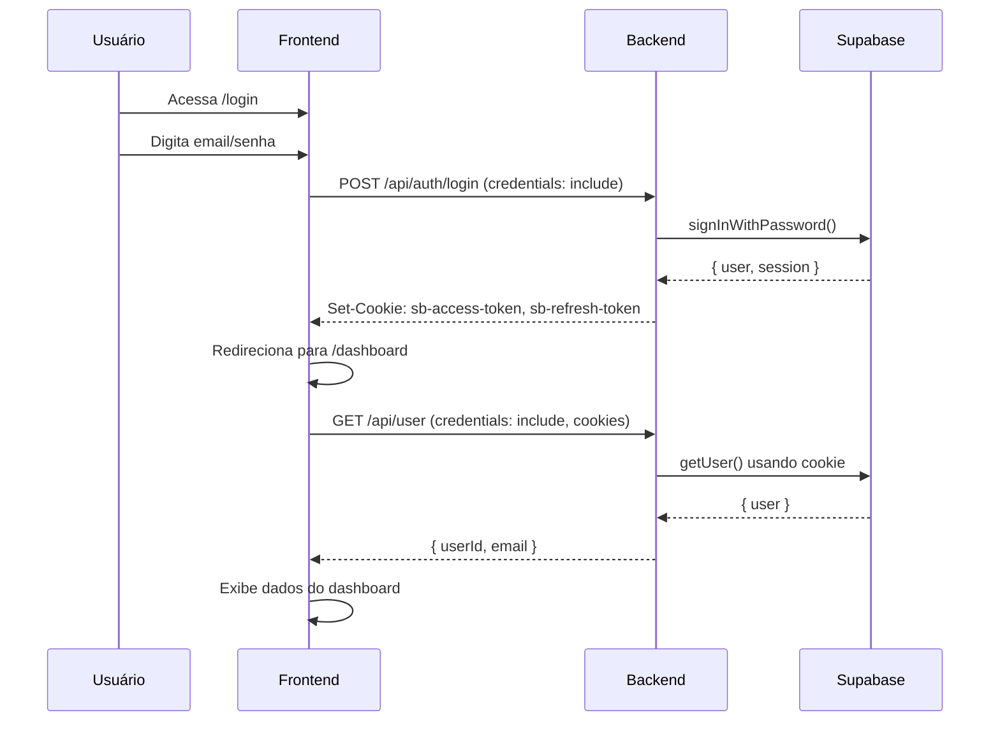

# 🚀 Guia de Deploy para Produção

## ⚠️ Problemas Comuns em Produção vs. Local

### 1. Cookies não funcionam entre domínios diferentes

**Problema**: Localmente, o frontend e backend podem estar na mesma origem ou em `localhost`. Em produção, geralmente são domínios diferentes (ex: `app.seusite.com` e `api.seusite.com`).

**Solução Aplicada**:
- Configuramos `SameSite=None` e `Secure=true` para cookies em produção
- Adicionamos suporte a múltiplas origens no CORS
- Incluímos o header `Vary: Origin` para cache correto

### 2. CORS não permite a origem de produção

**Problema**: O backend só permite `localhost:3001` mas em produção o frontend está em `https://seudominio.vercel.app`

**Solução**: Configure as variáveis de ambiente corretas (veja abaixo)

## 📋 Variáveis de Ambiente para Produção

### Backend (Este Projeto)

Configure estas variáveis no painel da Vercel/Railway/Render:

```env
# Supabase
NEXT_PUBLIC_SUPABASE_URL=https://scsldapnrzpjkyqkeiop.supabase.co
NEXT_PUBLIC_SUPABASE_ANON_KEY=eyJhbGciOiJIUzI1NiIsInR5cCI6IkpXVCJ9...
SUPABASE_SERVICE_ROLE_KEY=eyJhbGciOiJIUzI1NiIsInR5cCI6IkpXVCJ9...

# URLs - SUBSTITUA PELOS SEUS DOMÍNIOS DE PRODUÇÃO
NEXT_PUBLIC_API_BASE_URL=https://seu-backend.vercel.app
NEXT_PUBLIC_SITE_URL=https://seu-backend.vercel.app
FRONTEND_URL=https://seu-frontend.vercel.app
NEXT_PUBLIC_FRONTEND_URL=https://seu-frontend.vercel.app

# Stripe
STRIPE_SECRET_KEY=sk_live_xxx...  # ⚠️ Use chave LIVE em produção
SECRET_STRIPE_KEY=sk_live_xxx...
NEXT_PUBLIC_STRIPE_PUBLISHABLE_KEY=pk_live_xxx...

# Node Environment
NODE_ENV=production
```

### Frontend (Outro Repositório)

Configure no painel do frontend:

```env
# API do Backend
NEXT_PUBLIC_API_BASE_URL=https://seu-backend.vercel.app

# Supabase
NEXT_PUBLIC_SUPABASE_URL=https://scsldapnrzpjkyqkeiop.supabase.co
NEXT_PUBLIC_SUPABASE_ANON_KEY=eyJhbGciOiJIUzI1NiIsInR5cCI6IkpXVCJ9...

# Stripe
NEXT_PUBLIC_STRIPE_PUBLISHABLE_KEY=pk_live_xxx...
```

## 🔐 Configurações do Supabase para Produção

1. **Acesse o Supabase Dashboard**: https://app.supabase.com/project/scsldapnrzpjkyqkeiop

2. **Authentication → URL Configuration**:
   
   Adicione suas URLs de produção em **Redirect URLs**:
   ```
   https://seu-frontend.vercel.app/dashboard
   https://seu-frontend.vercel.app/auth/callback
   https://seu-backend.vercel.app/dashboard
   ```

3. **Authentication → Site URL**:
   ```
   https://seu-frontend.vercel.app
   ```

4. **Configuração de Cookies** (se disponível):
   - Cookie Domain: `.vercel.app` (se ambos os projetos estão na Vercel)
   - Ou deixe vazio para permitir qualquer domínio

## 🎯 Checklist de Deploy

### Antes do Deploy

- [ ] Todas as variáveis de ambiente estão configuradas corretamente
- [ ] URLs não têm barras finais (`/`)
- [ ] Chaves do Stripe de produção estão configuradas (se aplicável)
- [ ] Supabase está configurado com as URLs de produção

### Após o Deploy

- [ ] Testar login no ambiente de produção
- [ ] Verificar se o cookie de sessão está sendo criado (DevTools → Application → Cookies)
- [ ] Testar acesso ao dashboard
- [ ] Testar chamada para API Stripe
- [ ] Verificar logs de erro no console do navegador
- [ ] Verificar logs do servidor (Vercel/Railway)

## 🐛 Troubleshooting em Produção

### Erro: "Cookies not found" ou "Unauthorized"

**Diagnóstico**: Abra o DevTools → Application → Cookies

- Se NÃO houver cookies do Supabase (`sb-*`):
  - ✅ Verifique se as variáveis `NEXT_PUBLIC_SUPABASE_URL` e `NEXT_PUBLIC_SUPABASE_ANON_KEY` estão corretas
  - ✅ Certifique-se de que o login está retornando sucesso
  - ✅ Verifique se o domínio dos cookies está correto

- Se houver cookies mas ainda der erro:
  - ✅ Verifique se `credentials: 'include'` está em todas as chamadas fetch
  - ✅ Confirme que CORS está configurado corretamente
  - ✅ Veja se os cookies têm `SameSite=None` e `Secure=true`

### Erro: CORS policy

**Console mostra**: `Access to fetch has been blocked by CORS policy`

**Solução**:
1. Verifique se `FRONTEND_URL` e `NEXT_PUBLIC_FRONTEND_URL` no backend apontam para o domínio correto do frontend
2. Certifique-se de que não há barras finais nas URLs
3. Reinicie o deploy do backend após alterar variáveis de ambiente

### Erro: "Invalid redirect URL"

**Supabase mostra**: `redirect_to URL is not allowed`

**Solução**:
1. Vá em Supabase → Authentication → URL Configuration
2. Adicione todas as URLs de produção em **Redirect URLs**
3. Salve e aguarde alguns segundos

### Login funciona mas Dashboard não reconhece usuário

**Problema**: O middleware não está validando a sessão corretamente

**Solução**:
1. Verifique os logs do servidor
2. Confirme que `NEXT_PUBLIC_SUPABASE_URL` e `NEXT_PUBLIC_SUPABASE_ANON_KEY` estão corretas
3. Teste se a rota `/api/user` retorna os dados do usuário
4. Verifique se os cookies estão sendo enviados nas requisições

## 📊 Testando em Produção

### 1. Testar Login

```bash
# Substitua pela sua URL de produção
curl -X POST https://seu-backend.vercel.app/api/auth/login \
  -H "Content-Type: application/json" \
  -H "Origin: https://seu-frontend.vercel.app" \
  -d '{"email":"teste@exemplo.com","password":"senha123"}' \
  --cookie-jar cookies.txt \
  --include
```

Verifique se a resposta inclui:
- Status: `200 OK`
- Headers: `Set-Cookie: sb-...`
- Body: `{"success":true,"data":{...}}`

### 2. Testar Acesso ao Dashboard

```bash
curl -X GET https://seu-backend.vercel.app/api/user \
  -H "Origin: https://seu-frontend.vercel.app" \
  --cookie cookies.txt \
  --include
```

Deve retornar:
- Status: `200 OK`
- Body: `{"success":true,"data":{"userId":"...","email":"..."}}`

### 3. Testar Stripe Checkout

```bash
curl -X POST https://seu-backend.vercel.app/api/stripe/checkout-session \
  -H "Content-Type: application/json" \
  -H "Origin: https://seu-frontend.vercel.app" \
  --cookie cookies.txt \
  -d '{"amount":50,"productName":"Teste"}' \
  --include
```

Deve retornar:
- Status: `200 OK`
- Body: `{"success":true,"data":{"url":"https://checkout.stripe.com/..."}}`

## 🔄 Fluxo de Autenticação Esperado



## 📝 Notas Importantes

1. **Cookies Cross-Domain**: Em produção, sempre use HTTPS. Cookies com `SameSite=None` só funcionam via HTTPS.

2. **Chaves do Stripe**: 
   - Desenvolvimento: `sk_test_...` e `pk_test_...`
   - Produção: `sk_live_...` e `pk_live_...`

3. **Cache**: Após alterar variáveis de ambiente, faça um **Redeploy** completo (não apenas um novo commit).

4. **Logs**: Sempre monitore os logs do servidor e do navegador para identificar problemas rapidamente.

## 🆘 Ainda com Problemas?

Se após seguir todos os passos o problema persistir:

1. Compartilhe os logs do servidor (remova informações sensíveis)
2. Compartilhe os headers da requisição (Network tab no DevTools)
3. Confirme quais variáveis de ambiente estão configuradas
4. Teste localmente com as mesmas URLs de produção

## ✅ Resultado Esperado

Após seguir este guia:

- ✅ Login funciona em produção
- ✅ Usuário é redirecionado ao dashboard
- ✅ Dashboard carrega os dados corretamente
- ✅ Stripe checkout funciona
- ✅ Cookies são criados e enviados corretamente
- ✅ CORS não bloqueia requisições

---

**Última atualização**: 25 de novembro de 2025
